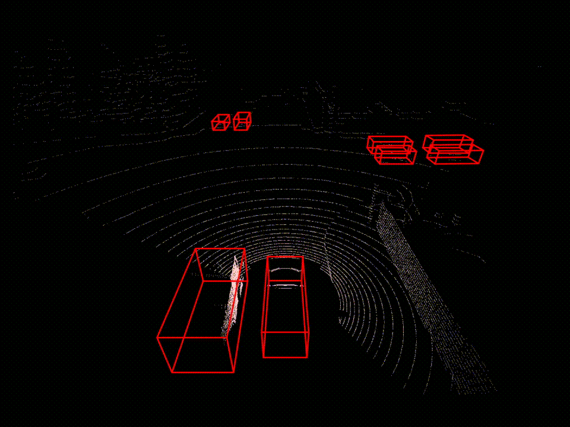
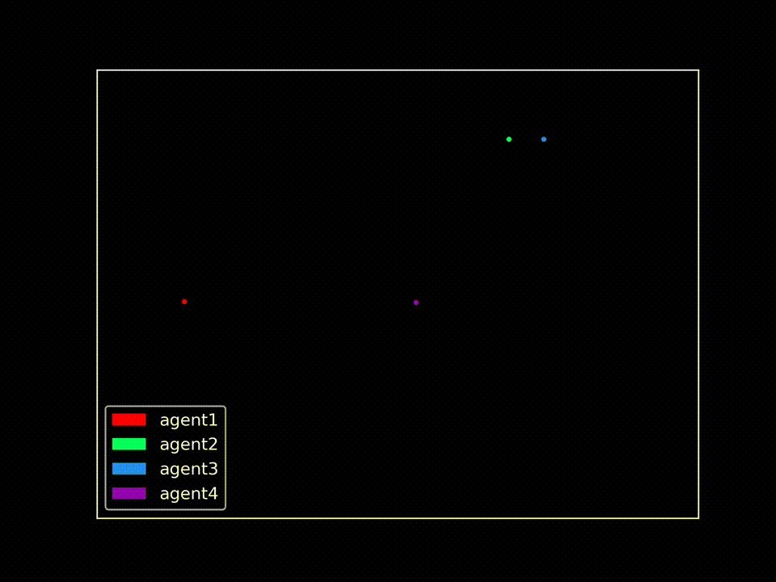

# Visualization tools for Collaborative Perception dataset

## Usage

I first reconstruct the nuscenes-format data, since it's very slow to read?
1.  `process_v2xsim_v2.py` will generate pkl file containing some meta-information of v2x-sim dataset, including lidar pose, gt boxes, and path to actually lidar file.
```
cd dataset_process
python process_v2xsim_v2.py
```


2. folder `simple_plot3d` is highly from [this repo](https://github.com/Divadi/simple_plot3d), `simple_plot3d/simple_vis.py` provide a warpper function for tensor format data. It can draw both BEV image and 3D view image. You can try to integrate the `visualize` function into your deep learning framework.


3. `simple_dataset.py` provide a simple dataset design for v2x-sim 2.0, it will retrieve meta information from pkl file and lidar numpy array using lidar file path.

4. Other files like `collaboration_view.py`, `single_view.py`, `scene_overview.py`, `location_in_bev.py` can draw seqences of pictures that provide a comprehensive overview of the dataset(given a scene). 
```
python single_view.py
python collaboration_view.py
python location_in_bev.py
python scene_overview.py
```
Then you can use `ima2video.py` to make image sequence to video.

5. You can run `visualize_data_seq.py` to see how to use the warp function `visualize` mentioned in 2., just 
```
python visualize_data_seq.py
```

GIFs are shown as below:




